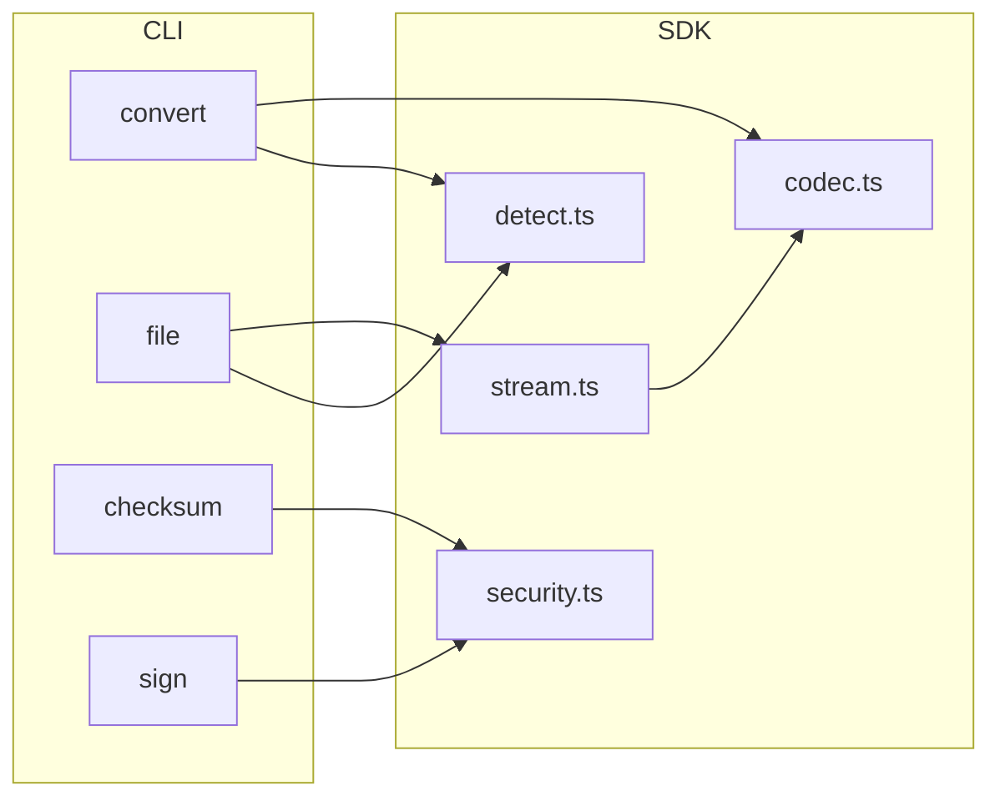

# PICYBOO Token Bridge Toolbox

A professional-grade toolbox for bridging proprietary PICYBOO™ offline tokens between interoperable encodings. The project showcases the engineering standards behind our token-bridging stack while keeping the confidential product surface area private.

> **Status**: Maintained reference implementation • Operational hardening pending • Roadmap-driven enhancements welcome

## Why this exists
- **Interoperability** — Provide a deterministic way to translate our custody tokens between `hex`, `base58`, and `base64` representations used across partner systems.
- **Operational assurance** — Demonstrate checksum and signature hygiene for stakeholders without revealing private bridge logic.
- **Public positioning** — Showcase engineering maturity with automated tests, modular architecture, and transparent roadmap.

## Architecture at a glance
The project is organised as a small SDK powering a modular CLI. All conversion primitives live in `src/lib`, while Commander-based subcommands are encapsulated in `src/commands` for easy extension.



Additional background and workflow notes are captured in [`docs/bridge-flow.mmd`](docs/bridge-flow.mmd).

## CLI usage
Install dependencies and build the project once:

```bash
npm install
npm run build
```

Then run the CLI locally (optionally `npm link` to expose the `pbbridge` command globally):

```bash
node dist/bin/cli.js --help
```

### Token conversion
```bash
pbbridge convert "48656c6c6f2050494359424f4f" --in hex --out base58
# -> 72k1xXWE6YyPQCPqRY

pbbridge convert "72k1xXWE6YyPQCPqRY" --in auto --out base64 --verbose
```

### File pipelines & streaming
```bash
pbbridge file ./examples/sample.txt --in auto --out base64 --detect -o ./out.txt
```
The `file` command uses Node.js streams internally. Hex and Base64 payloads are chunked progressively; Base58 payloads are buffered for integrity and flushed at the end.

### Security utilities
```bash
pbbridge checksum "deadbeef" --algorithm sha256
pbbridge checksum --file ./examples/sample.txt --verify <expected>

pbbridge sign "confidential" --key 001122... --algorithm hmac-sha512
pbbridge sign --file ./payload.bin --key-file ./secret.key --verify <signature>
```

## Library usage
All primitives are available as an importable SDK for internal services:

```ts
import { convertToken, detectEncoding, createChecksum } from 'picyboo-token-bridge';

const detection = detectEncoding(payload);
const converted = convertToken(payload, { inputEncoding: detection.encoding, outputEncoding: 'base58' });
const checksum = createChecksum(Buffer.from(converted, 'utf8'));
```

## Quality & compliance
- **Testing** — `npm test` runs an exhaustive Vitest suite covering codecs, detection heuristics, streaming transforms, and security helpers.
- **Type safety** — Strict TypeScript configuration ensures the CLI and SDK remain refactor-friendly.
- **Continuous integration** — GitHub Actions workflow template available under `.github/workflows/ci.yml` (copy into downstream repos) ensures build + test automation.

## Roadmap
1. **Binary stream passthrough** — support raw binary input without UTF-8 assumptions.
2. **Checksum registry** — plug-in registration for custom compliance-mandated algorithms.
3. **Hardware enclave hooks** — optional integration with secure key stores for signature material.

## Legal
© Picyboo Cybernetics. MIT License. PICYBOO is a trademark of Picyboo Cybernetics Inc.
